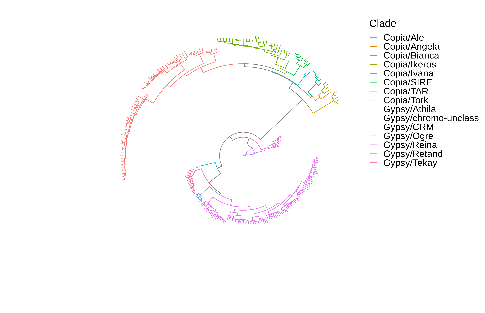

[](http://bioconda.github.io/recipes/tesorter/README.html) [](https://anaconda.org/bioconda/tesorter)
=========================================
# TEsorter
It is coded for [LTR_retriever](https://github.com/oushujun/LTR_retriever) to classify long terminal repeat retrotransposons (LTR-RTs) at first. It can also be used to classify any other transposable elements (TEs), including Class I and Class II elements which are covered by the [REXdb](http://repeatexplorer.org/?page_id=918) database.

Since version v1.4, a GENOME mode is supported to identify TE protein domains throughout whole genome.

For more details of methods and benchmarking results in classifying TEs, please see [the paper in *Horticulture Research*](https://doi.org/10.1093/hr/uhac017).


## Table of Contents
   * [Installation](#installation)  
       * [Using bioconda](using-bioconda)
       * [Old school](#old-school)
   * [Quick Start](#quick-start)
   * [Citation](#Citation)
   * [Outputs](#outputs)
   * [Usage](#usage)
   * [Limitations](#limitations)
   * [Further phylogenetic analyses](#further-phylogenetic-analyses)
   * [Extracting TE sequences from genome for TEsorter](#extracting-te-sequences-from-genome-for-tesorter)

## Installation

### Using bioconda

```
conda install -c bioconda tesorter
```

### Old school

Dependencies:
+    [python >3](https://www.python.org/)  
	+   [biopython](https://biopython.org/): quickly install by `pip install biopython` or `conda install biopython`  
	+   [xopen](https://pypi.org/project/xopen/): quickly install by `pip install xopen` or `conda install xopen`
+   [hmmscan 3.3x](http://hmmer.org/): be compatible with HMMER3/f database format. quickly install by `conda install hmmer`
+   [blast+](https://blast.ncbi.nlm.nih.gov/Blast.cgi?CMD=Web&PAGE_TYPE=BlastDocs&DOC_TYPE=Download): quickly install by `conda install blast`
+ TEsorter:
```
git clone https://github.com/zhangrengang/TEsorter
cd TEsorter
python setup.py install
```
## Quick Start
```
# run the example
TEsorter-test
# or
TEsorter TEsorter/test/rice6.9.5.liban
```
By default, the newly released [REXdb](http://repeatexplorer.org/?page_id=918) ([viridiplantae_v3.0 + metazoa_v3](https://bitbucket.org/petrnovak/re_databases)) database is used, which is more sensitive and more common and thus is recommended.

For plants ([an example](https://raw.githubusercontent.com/oushujun/EDTA/master/database/rice6.9.5.liban)), it might be better to use only the plant database (Note that the input file is TE or LTR sequences but not genome sequences):
```
TEsorter input_file -db rexdb-plant
```

Classical [GyDB](http://gydb.org/) can also be used:
```
TEsorter input_file -db gydb
```
To speed up, use more processors [default=4]:
```
TEsorter input_file -p 20
```
To improve sensitivity, reduce the criteria (coverage and E-value):
```
TEsorter input_file -p 20 -cov 10 -eval 1e-2
```
To improve specificity, increase the criteria and disable the pass2 mode:
```
TEsorter input_file -p 20 -cov 30 -eval 1e-5 -dp2
```
To improve sensitivity of pass-2, reduce the [80–80–80 rule](http://doi.org/10.1038/nrg2165-c3) which may be too strict for superfamily-level classification:
```
TEsorter input_file -p 20 -rule 70-30-80
```
To classify TE polyprotein sequences ([an example](http://www.repeatmasker.org/RMDownload.html)) or gene protein seqeunces:
```
TEsorter RepeatPeps.lib -st prot -p 20
```
Since version v1.4, a GENOME mode is supported to identify TE protein domains throughout whole genome:
```
TEsorter genome.fasta -genome -p 20 -prob 0.9
```
## Citation
If you use the `TEsorter` tool, please cite:
> Zhang RG, Li GL, Wang XL et. al. TEsorter: an accurate and fast method to classify LTR retrotransposons in plant genomes [J]. *Horticulture Research*, 2022, 9: uhac017 [https://doi.org/10.1093/hr/uhac017](https://doi.org/10.1093/hr/uhac017)

If you use the REXdb database (`-db rexdb*`), please cite:
> Neumann P, Novák P, Hoštáková N et. al. Systematic survey of plant LTR-retrotransposons elucidates phylogenetic relationships of their polyprotein domains and provides a reference for element classification [J]. *Mobile DNA*, 2019, 10: 1 [https://doi.org/10.1186/s13100-018-0144-1](https://doi.org/10.1186/s13100-018-0144-1)

If you use the GyDB database (`-db gydb`), please cite:
> Llorens C, Futami R, Covelli L et. al. The Gypsy Database (GyDB) of mobile genetic elements: release 2.0 [J]. *Nucleic Acids Research*, 2011, 39: 70–74 [https://doi.org/10.1093/nar/gkq1061](https://doi.org/10.1093/nar/gkq1061)

## Outputs  
```
rice6.9.5.liban.rexdb.domtbl        HMMScan raw output
rice6.9.5.liban.rexdb.dom.faa       protein sequences of domain, which can be used for phylogenetic analysis.
rice6.9.5.liban.rexdb.dom.tsv       inner domains of TEs/LTR-RTs, which might be used to filter domains based on their scores and coverages.
rice6.9.5.liban.rexdb.dom.gff3      domain annotations in `gff3` format
rice6.9.5.liban.rexdb.cls.tsv       TEs/LTR-RTs classifications
    Column 1: raw id
    Column 2: Order, e.g. LTR
    Column 3: Superfamily, e.g. Copia
    Column 4: Clade, e.g. SIRE
    Column 5: Complete, "yes" means one LTR Copia/Gypsy element with full GAG-POL domains.
    Column 6: Strand, + or - or ?
    Column 7: Domains, e.g. GAG|SIRE PROT|SIRE INT|SIRE RT|SIRE RH|SIRE; `none` for pass-2 classifications
rice6.9.5.liban.rexdb.cls.lib       fasta library for RepeatMasker
rice6.9.5.liban.rexdb.cls.pep       the same sequences as `rice6.9.5.liban.rexdb.dom.faa`, but id is changed with classifications.
```
Note: the GENOME mode (`-genome`) will not output `*.cls.*` files.

## Usage  
```
$ TEsorter  -h
usage: TEsorter [-h] [-v] [-db {gydb,rexdb,rexdb-plant,rexdb-metazoa,sine}]
                [-st {nucl,prot}] [-pre PREFIX] [-fw] [-p PROCESSORS]
                [-tmp TMP_DIR] [-cov MIN_COVERAGE] [-eval MAX_EVALUE] [-nocln]
                [-dp2] [-rule PASS2_RULE] [-nolib] [-norc] [-genome]
                sequence

lineage-level classification of transposable elements using conserved protein
domains.

positional arguments:
  sequence              input TE/LTR or genome sequences in fasta format
                        [required]

optional arguments:
  -h, --help            show this help message and exit
  -v, --version         show program's version number and exit
  -db {gydb,rexdb,rexdb-plant,rexdb-metazoa,sine}, --hmm-database {gydb,rexdb,rexdb-plant,rexdb-metazoa,sine}
                        the database used [default=rexdb]
  -st {nucl,prot}, --seq-type {nucl,prot}
                        'nucl' for DNA or 'prot' for protein [default=nucl]
  -pre PREFIX, --prefix PREFIX
                        output prefix [default='{-s}.{-db}']
  -fw, --force-write-hmmscan
                        if False, will use the existed hmmscan outfile and
                        skip hmmscan [default=False]
  -p PROCESSORS, --processors PROCESSORS
                        processors to use [default=4]
  -tmp TMP_DIR, --tmp-dir TMP_DIR
                        directory for temporary files
                        [default=./tmp-073acf8a-a062-11ec-a3ba-a0369fc22fb8]
  -cov MIN_COVERAGE, --min-coverage MIN_COVERAGE
                        mininum coverage for protein domains in HMMScan output
                        [default=20]
  -eval MAX_EVALUE, --max-evalue MAX_EVALUE
                        maxinum E-value for protein domains in HMMScan output
                        [default=0.001]
  -nocln, --no-cleanup  do not clean up the temporary directory
                        [default=False]

ElEMENT mode (default):
  Input TE/LTR sequences to classify them into clade-level.

  -dp2, --disable-pass2
                        do not further classify the unclassified sequences
                        [default=False for `nucl`, True for `prot`]
  -rule PASS2_RULE, --pass2-rule PASS2_RULE
                        classifying rule [identity-coverage-length] in pass-2
                        based on similarity [default=80-80-80]
  -nolib, --no-library  do not generate a library file for RepeatMasker
                        [default=False]
  -norc, --no-reverse   do not reverse complement sequences if they are
                        detected in minus strand [default=False]

GENOME mode:
  Input genome sequences to detect TE protein domains throughout whole
  genome.

  -genome               input is genome sequences [default=False]
  -win_size WIN_SIZE    window size of chunking genome sequences
                        [default=270000]
  -win_ovl WIN_OVL      overlap size of windows [default=30000]
```


## Limitations  
1. For each domain (e.g. RT), only the best hit with the highest score will output, which means: 1) if frame is shifted, only one part can be annotated; 2) for example, if two or more RT domains are present in one query sequence, only one of these RT domains will be annotated.
2. Many LTR-RTs cannot be classified due to no hit, which might be because: 1) the database is still incompleted; 2) some LTR-RTs may have too many mutations such as frame shifts and stop gains or have lost protein domains; 3) some LTR-RTs may be identified false positively. For the test data set ([rice6.9.5.liban](https://raw.githubusercontent.com/oushujun/EDTA/master/database/rice6.9.5.liban)), ~84% LTR-RTs (_INT sequences) are classified.
3. Non-autonomous TEs that lack protein domains, some un-active autonomous TEs that have lost their protein domains and any other elements that contain none protein domains, are excepted to be un-classified.

## Further phylogenetic analyses  
You may want to use the RT domains to analysis relationships among retrotransposons (LTR, LINE, DIRS, etc.). Here is an example (with [mafft](https://mafft.cbrc.jp/alignment/software/) and [iqtree](http://www.iqtree.org/) installed):
```
# to extract RT domain sequences
concatenate_domains.py rice6.9.5.liban.rexdb.cls.pep RT > rice6.9.5.liban.rexdb.cls.pep.RT.aln

# to reconduct the phylogenetic tree with IQTREE or other tools
iqtree -s rice6.9.5.liban.rexdb.dom.RT.aln -bb 1000 -nt AUTO

# Finally, visualize and edit the tree 'rice6.9.5.liban.rexdb.RT.faa.aln.treefile' with FigTree or other tools.
```
The alignments of LTR-RTs full domains can be generated by (align and concatenate; `concatenate_domains.py` will convert all special characters to `_` to be compatible with `iqtree` and `scripts/LTR_tree.R`):
```
concatenate_domains.py rice6.9.5.liban.rexdb.cls.pep GAG PROT RH RT INT > rice6.9.5.liban.rexdb.cls.pep.full.aln
```
The alignments of Class I INT and Class II TPase (DDE-transposases) can be generated by:
```
concatenate_domains.py rice6.9.5.liban.rexdb.cls.pep INT > rice6.9.5.liban.rexdb.cls.pep.INT.aln
concatenate_domains.py rice6.9.5.liban.rexdb.cls.pep TPase > rice6.9.5.liban.rexdb.cls.pep.TPase.aln
cat rice6.9.5.liban.rexdb.cls.pep.INT.aln rice6.9.5.liban.rexdb.cls.pep.TPase.aln > rice6.9.5.liban.rexdb.cls.pep.INT_TPase.faa
mafft --auto rice6.9.5.liban.rexdb.cls.pep.INT_TPase.faa > rice6.9.5.liban.rexdb.cls.pep.INT_TPase.aln
```
Note: the domain names between rexdb and gydb are somewhat different: PROT (rexdb) = AP (gydb), RH (rexdb) = RNaseH (gydb). Please use the actual domain name.

Here, an R script (depending on [ggtree](https://yulab-smu.top/treedata-book/)) is provided to fast visualize the LTR tree. An example in `example_data/`:
```
../scripts/LTR_tree.R rice6.9.5.liban.rexdb.cls.pep_RT_RH_INT.aln.treefile rice6.9.5.liban.rexdb.cls.tsv rice6.9.5.liban.rexdb.cls.pep_RT_RH_INT.aln.treefile.png
```


## Extracting TE sequences from genome for TEsorter  
Here are examples to extract TE sequences from outputs of wide-used softwares, when you have only genome sequences.

1. extract all TE sequences from [RepeatMasker](http://www.repeatmasker.org/RMDownload.html) output:
```
# run RepeatMasker, which will generate a *.out file.
RepeatMasker [options] genome.fa

# extract sequences
RepeatMasker.py out2seqs genome.fa.out genome.fa > whole_genome_te.fa

# classify
TEsorter whole_genome_te.fa [options]
```

2. extract all intact LTR-RTs sequences from [LTR_retriever](https://github.com/oushujun/LTR_retriever) outputs:
```
# run LTR_retriever, which generate two *.pass.list files.
LTR_retriever -genome genome.fa [options]

# extract sequences
LTR_retriever.py get_full_seqs genome.fa > intact_ltr.fa

# classify
TEsorter intact_ltr.fa [options]
```
